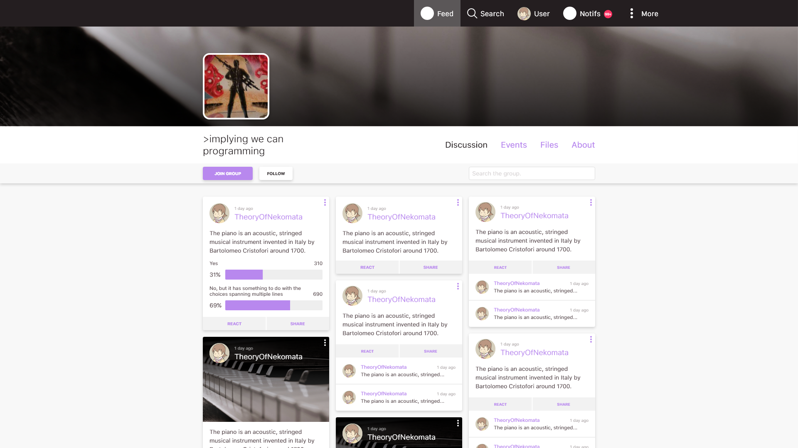

# Kamina

[//]: # (This and the logo line are comments for Ziad to uncomment when he edits because)
[//]: # (he likes to see the pretty logo in pycharm when he edits the docs uwu )

	

  
<small>Nice logo amirite.</small>

## Overview
**Kamina** is an IPFS-based, decentralized social network with free speech in mind...
 
The social network is divided into communities, each with it's independent governing system.

## Vision
We want to develop a decentralized social network, that gives control to its users over their own personal information.
Our decision to start this idea stemmed from many events in which facebook has been mistreating our personal data, the 
Cambridge Analytica incident being an example, however, it is safe to say that the fact that Facebook has been 
selling all our data to advertisers and the general idea that centralized services that are not paid for tend to use 
this business model is plenty reason to want a decentralized alternative. Many similar products have been made to 
replace other services in this same manner.  

## Design Decisions and Technicalities
*Kamina* aims to be as decentralized as possible without becoming a full-blown 'distributed system'. After 
analyzing the possible technologies that could help us reach this objective, we've found out that **IPFS**, while still 
being in its infancy, is a good option to store information for *Kamina*. 

We chose Python3 because it is cross platform, easy to learn and work with, and has a large community.

*Kamina* will be split into 3 separate components that will communicate with each other. 

- *Kamina Community*
- *Kamina User*
- *Kamina Search*

The APIs for each component will be implemented in Flask and the front end of each will be implemented using VueJS.

### Kamina Community
*Kamina Community* is, as the name suggests, where all the users interact and communicate. 
- Each *Kamina Community* instance has a single, broad or otherwise, discussion topic much in the same way you can have 
groups for different topics and interests on Facebook and other social networks. 

-Anyone can access and start using a *Kamina Community* instance, but the user is be limited to what it can do. In 
order to access all the functionality of the instance, the user has to register into that community. The registration 
requires the user to download and start a *Kamina User* instance on their device.

This is an example of what a *Kamina Community* instance would look like.
   

### Kamina User

This is where all the user information is stored and managed.

- In order to give the user full control over their information, the information is stored on the user's device.

- The user must download and initialize a user instance on their device and can then register into any existing 
*Kamina Community* instance. 

- The instance exposes an API for the *Kamina Community* instance to exchange information with.

### Kamina Search

*Kamina Search* is a system allows the user to access information from a *Kamina Community* instance.

- It stores backup data from *Kamina Community* instances in case the data disappears. 

- Works similar to Mastodon search instances. [search page](https://instances.social/list#lang=&allowed=&prohibited=&users=)

- The user can access the content of a *Kamina Community* up until the date of the creation of the backup stored. 

## How to contribute
Third-party changes are essential in order for Kamina to improve. We simply don't have access to every platform in existence, so we want to keep it simple for you to contribute patches that
get things working in your environment. There are a few guidelines before you can start making
pull requests.

### Getting Started
* Make sure you have a GitHub account.
* Create an issue in the corresponding project (community, user, search, etc.) if one does not already exist.
	- Clearly describe the issue including steps to reproduce if it is a bug.
	- Make sure to add the earliest version that contains that issue.
* Fork the repository on GitHub.

### Making Changes
* Create a new branch from where you will base your work.
* Make commits of logical and atomic units.
* Be sure you are following pep-8 when writing the code.

### Submitting Changes
* Push your changes to a branch in your fork of the repository.
* Before submitting a pull request:
	- Run pylint in all the files you have modified
	- Describe the changes you've made as verbose as possible
* Submit a pull request to the project's repository.
* If after 2 weeks of giving feedback there is no activity, the pull request will be closed.

### Additional Resources
* [pylint](https://www.pylint.org/)
* [PEP 8](https://www.python.org/dev/peps/pep-0008/)
